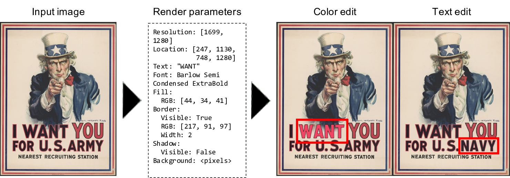
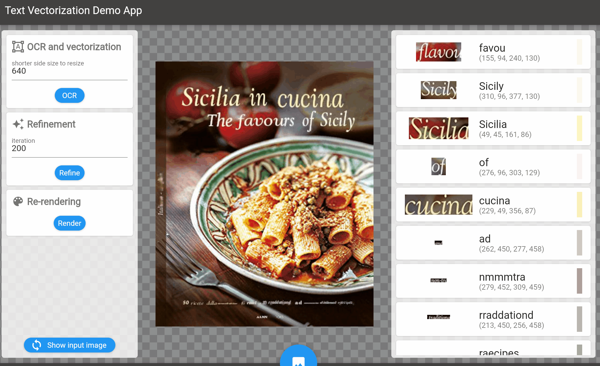

## Paper: De-rendering Stylized Texts


Wataru Shimoda<sup>1</sup>, Daichi Haraguchi<sup>2</sup>, Seiichi Uchida<sup>2</sup>, Kota Yamaguchi<sup>1</sup>  
<sup>1</sup>CyberAgent.Inc, <sup>2</sup> Kyushu University  
Accepted to ICCV2021.
[[Publication](https://openaccess.thecvf.com/content/ICCV2021/html/Shimoda_De-Rendering_Stylized_Texts_ICCV_2021_paper.html)]
[[Arxiv](https://arxiv.org/abs/2110.01890)]
[[project-page](https://cyberagentailab.github.io/derendering-text/)]

## Introduction
This repository contains the codes for ["De-rendering stylized texts"](https://arxiv.org/abs/2110.01890).
### Concept
We propose to parse rendering parameters of stylized texts utilizing a neural net.


### Demo
The proposed model parses rendering parameters based on famous 2d graphic engine[[Skia.org](https://skia.org/)|[python implementation](https://github.com/kyamagu/skia-python)], which has compatibility with CSS in the Web.
We can export the estimated rendering parameters and edit texts by an off-the-shelf rendering engine.

<div align = 'center'>


</div>


## Installation

### Requirements
- Python >= 3.7
- Pytorch >= 1.8.1
- torchvision >= 0.9.1

```bash
pip install -r requirements.txt
```

### Font data
- The proposed model is trained with google fonts.
- ~~Download google fonts and locate in `data/fonts/` as `gfonts`.~~
	- Note: the organization of font files in the [google fonts](https://github.com/google/fonts.git) is updated from our environment. 
- Download font files from this link([ofl](https://drive.google.com/file/d/139WdwF7BUKKreELK9jdKXZaYqRQd_pzn/view?usp=sharing)) and locate in `data/fonts/gfonts/`.

```diff
- cd　data/fonts
- git clone https://github.com/google/fonts.git gfonts
+ mkdir data/fonts/gfonts; cd data/fonts/gfonts
+ tar xvzf ofl.tar.gz
``` 

### Pre-rendered alpha maps
- The proposed model parses rendering parameters and refines them through the differentiable rendering model, which uses pre-rendered alpha maps.  
- Generate pre-rendered alpha maps.
```bash
python -m util_lib.gen_pams
```
Pre-rendered alpha maps would be generated in `data/fonts/prerendered_alpha`.

<div align = 'center'>


</div>


## Usage

### Test
- Download the pre-trained weight from this link
([weight](https://drive.google.com/file/d/1HBcfV0nfSluCWCHGgGerx7QNJZJpOv3h/view?usp=sharing)).  
- Locate the weight file in `weights/font100_unified.pth`.  

Example usage.
```bash
python test.py --imgfile=example/sample.jpg
```
Note
- imgfile option: path of an input image
- results would be generated in `res/`

### Text image editing
The proposed model generates a reconstructed image and a pickle file for the parsed rendering parameters.  
Here, we prepare a notebook file:`text_edit.ipynb` for the guide of the processings to edit text images using the parsed rendering parameters.  

#### Some examples from `text_edit.ipynb`:
<div align = 'center'>
<p>Background editing</p>

</div>

<div align = 'center'>
<p>Text editing</p>

</div>

<div align = 'center'>
<p>Border effect editing</p>

</div>

<div align = 'center'>
<p>Shadow effect editing</p>

</div>

<div align = 'center'>
<p>Text offsets editing</p>

</div>

<div align = 'center'>
<p>Font editing</p>

</div>


### Data generation
Quick start.
```bash
python gen.py --bgtype=load --bg_dir=src/modules/generator/example/bg --mask_dir=src/modules/generator/example/mask
```
The generated text images would be located in `gen_data/`.

For the detail, see [generator](https://github.com/CyberAgentAILab/derendering-text/blob/master/src/modules/generator/README.md).

### Train text parser model
Quick start.
Generate training data using simple background dataset.
```bash
python gen.py --bgtype=color
```

Train text parser model with the generated simple background data.
```bash
python train.py
```

For the detail, see [trainer](https://github.com/CyberAgentAILab/derendering-text/blob/master/src/modules/trainer/README.md).

### Attribute details


## Todo
- [x] Testing codes
- [x] Codes for the text image generator
- [x] Notebook for text editing
- [x] Training codes for text paraser model
- [x] Training codes for inpainting model
- [ ] Demo app

## Reference
```bibtex
@InProceedings{Shimoda_2021_ICCV,
    author    = {Shimoda, Wataru and Haraguchi, Daichi and Uchida, Seiichi and Yamaguchi, Kota},
    title     = {De-Rendering Stylized Texts},
    booktitle = {Proceedings of the IEEE/CVF International Conference on Computer Vision (ICCV)},
    month     = {October},
    year      = {2021},
    pages     = {1076-1085}
}
```

## Contact
This repository is maintained by Wataru shimoda(wataru_shimoda[at]cyberagent.co.jp).
