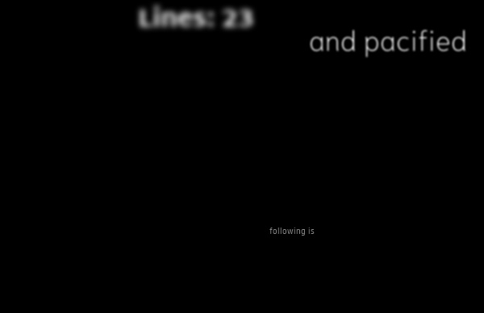

# Text Image Generator
This work is inspired by [SynthText](https://github.com/ankush-me/SynthText).  
We focus on text images for the displayed media such as posters, web pages, or advertisements.  

## Introduction
This text image generator repeats the following steps to generate text images.
- Sample parameters for a text
- Render a text with the parameters

### Renderer
This text image generator's renderer is based on [skia-python](https://github.com/kyamagu/skia-python), which is a python binding to the modern 2d graphic engine [Skia.org](https://Skia.org).

Currently, we support the following effects.
- Fill
- Border
- Shadow
- Gradation(not used in the training of the model in the paper)


### Sampler
Our sampler consists of three steps.
- Text and font sampler 
    - Sample pairs of text contents and fonts.
- Offset sampler 
    - Sample spatial offsets for locating texts.
- Style sampler 
    - Sample effect information for text styling.

## Usage
Quick start.
```bash
python gen.py --bgtype=load --bg_dir=src/modules/generator/example/bg --mask_dir=src/modules/generator/example/mask
```

## Output data format

### Directory organization

The generated text images and rendering parameters would be located in `gen_data/${save_dir}`.  
The organization of the generated data is as following:
<pre> 
gen_data
└── ${save_dir}
    ├── img/
    ├── bg/
    ├── alpha/
    ├── metadata/
    └── save_data_info.pkl
</pre>

- Directory for generated text images: `gen_data/${save_dir}/img`.
- Directory for background images: `gen_data/${save_dir}/bg`
- Directory for text alpha maps: `gen_data/${save_dir}/alpha`
- Directory for rendering parameters: `gen_data/${save_dir}/metadata`
- Pickle data for the information of the generator: `save_data_info.pkl`

### Description for formats of generated data

#### Alpha maps
Text alpha maps for the effects are stored with `.npz` format.
Each alpha maps' dimension would be `Height x Width x 3` in the current version of the generator.
The first channel is for shadow effect alpha, the second channel is for fill effect alpha and the third channel is for border effect alpha.
#### Rendering parameters
Rendering parameters are stored by `pickle data format`  with the `@dataclass` object: `TrainingFormatData()` in `src/dto/dto_generator.py`.
The class has below attributes:
- charBB: bounding boxes for characters
- wordBB: bounding boxes for texts
- texts: text contents
- font_data: font information
- text_form_data: List[TextFormData]
- effect_params: parameters for effects
- effect_visibility: visibility flag for effects
- text_offsets: spatial offsets for texts
- char_offsets: spatial offsets for characters

Note
- Some attributes are nested by other `@dataclass` objects.

## Visualizer
We prepare visualizer for the generated data.  
To visualize, run `util_lib/visualizer.py` with a target metadata file name.  
Example usage.
```bash
python -m util_lib.visualizer --filename=gen_data/load_eng_tmp/metadata/0_0.pkl
```

| |  | |
|--|--|--|
| <center>Rendered image</center> | <center>Character bounding boxes</center> | <center>Text bounding boxes</center> |

| |  | |
|--|--|--|
| <center>Shadow effect alpha</center> | <center>Fill effect alpha</center> | <center>Border effect alpha</center> |


## Datasets

We generate text images with the following five types of background images.
- SynthText dataset
- FMD dataset
- Color dataset
- Book cover dataset
- BAM dataset

### SynthText dataset
Use Pre-processed Background Images in [SynthText](https://github.com/ankush-me/SynthText).
Download the following files and locate them in `data/`.
- http://thor.robots.ox.ac.uk/~vgg/data/scenetext/preproc/bg_img.tar.gz
- http://thor.robots.ox.ac.uk/~vgg/data/scenetext/preproc/depth.h5
- http://thor.robots.ox.ac.uk/~vgg/data/scenetext/preproc/seg.h5

Note: Decompress `bg_img.tar.gz` by `tar xvzf bg_img.tar.gz`.

Run
```bash
python gen.py --bgtype=synth_text
```

### Color background
This data generation requires no datasets.
Run
```bash
python gen.py --bgtype=color
```

### FMD dataset
Download datasets from [link](https://people.csail.mit.edu/celiu/CVPR2010/FMD/) and locate them in `data/`.
Run
```bash
python gen.py --bgtype=fmd
```

### BAM dataset
Download datasets from [link](https://bam-dataset.org/).  
Pre-compute saliency mask for limiting text area.  
In the paper, we generate masks by [saliency model](https://github.com/backseason/PoolNet) and erase texts in BAM images in advance utilizing existing OCR and inpainting models.  
For erasing texts, we will prepare a util library in `util_lib/eraser.py`.  
I recommend utilizing them.  

After the pre-processings, run with specifying the directories of background images and masks with options.
```bash
python gen.py --bgtype=bam --bg_dir=${bg_dir} --mask_dir=${mask_dir}
```

### BOOK dataset
Download datasets from [link](https://github.com/uchidalab/book-dataset).  
Generate mask and erase texts in the similar way to the BAM dataset.  
After the pre-processings, run with specifying the directories of background images and masks with options.
```bash
python gen.py --bgtype=book --bg_dir=${bg_dir} --mask_dir=${mask_dir}
```

### Other background images.
Any images would be used as background images if we generate masks using salinecy maps and apply the text eraser in advance.
After the pre-processings, run with specifying the directories of background images and masks with options.
```bash
python gen.py --bgtype=load --bg_dir=${bg_dir} --mask_dir=${mask_dir}
```
Note: some texts may remain in images if we use the text eraser. However, it will harms only training of the text foreground prediction. The generated images will support the training of estimation of other rendering parameters though some texts remain in background images.